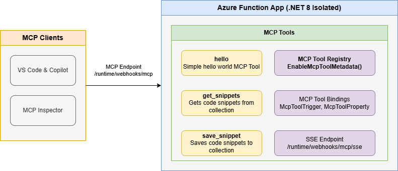

<!--
---
name: Remote MCP with Azure Functions (.NET/C#)
description: Run a remote MCP server on Azure functions.  
page_type: sample
languages:
- csharp
- bicep
- azdeveloper
products:
- azure-functions
- azure
urlFragment: remote-mcp-functions-dotnet
---
-->

# Getting Started with Remote MCP Servers using Azure Functions (.NET/C#)

This is a quickstart template to easily build and deploy a custom remote MCP server to the cloud using Azure functions. You can clone/restore/run on your local machine with debugging, and `azd up` to have it in the cloud in a couple minutes.  The MCP server is secured by design using keys and HTTPs, and allows more options for OAuth using EasyAuth and/or API Management as well as network isolation using VNET.  

**Watch the video overview**

<a href="https://www.youtube.com/watch?v=XwnEtZxaokg">
  
</a>

If you're looking for this sample in more languages check out the [Node.js/TypeScript](https://github.com/Azure-Samples/remote-mcp-functions-typescript) and [Python](https://github.com/Azure-Samples/remote-mcp-functions-python) samples.  

[](https://codespaces.new/Azure-Samples/remote-mcp-functions-dotnet)

## Prerequisites

### Required for all development approaches:
+ [.NET 8 SDK](https://dotnet.microsoft.com/download/dotnet/8.0)
+ [Azure Functions Core Tools](https://learn.microsoft.com/azure/azure-functions/functions-run-local?pivots=programming-language-csharp#install-the-azure-functions-core-tools) >= `4.0.7030`
+ [Azure Developer CLI](https://aka.ms/azd) (for deployment)

### For Visual Studio development:
+ [Visual Studio 2022](https://visualstudio.microsoft.com/vs/)
+ Make sure to select the **Azure development** workload during installation

### For Visual Studio Code development:
+ [Visual Studio Code](https://code.visualstudio.com/)
+ [Azure Functions extension](https://marketplace.visualstudio.com/items?itemName=ms-azuretools.vscode-azurefunctions)

> **Choose one**: You can use either Visual Studio OR Visual Studio Code. Both provide full debugging support, but the setup steps differ slightly.

Below is the architecture diagram for the Remote MCP Server using Azure Functions:



## Prepare your local environment

An Azure Storage Emulator is needed for this particular sample because we will save and get snippets from blob storage. 

1. Start Azurite

    ```shell
    docker run -p 10000:10000 -p 10001:10001 -p 10002:10002 \
        mcr.microsoft.com/azure-storage/azurite
    ```

>**Note** if you use Azurite coming from VS Code extension you need to run `Azurite: Start` now or you will see errors.

## Run your MCP Server locally

Choose your preferred development environment:

### Option A: Using Visual Studio Code

#### Run from Terminal
1. From the `src` folder, run this command to start the Functions host locally:

    ```shell
    cd src
    func start
    ```

#### Run and Debug from VS Code
1. Open the repository in Visual Studio Code
1. Press `F5` or go to **Run > Start Debugging**
1. VS Code will build the project and start the Azure Functions host
1. The MCP server will be available at `http://0.0.0.0:7071/runtime/webhooks/mcp/sse`

### Option B: Using Visual Studio 

1. Open `FunctionsMcpTool.sln` in Visual Studio 2022
1. Ensure you have the **Azure development** workload installed
1. Set `FunctionsMcpTool` as the startup project (right-click the project and select "Set as Startup Project")
1. Press `F5` or click **Debug > Start Debugging**
1. Visual Studio will build the project and launch the Azure Functions host
1. The MCP server will be available at `http://localhost:7071/runtime/webhooks/mcp/sse`

> **Key Differences:**
> - **VS Code**: Uses external terminal and Azure Functions extension, URL uses `0.0.0.0`
> - **Visual Studio**: Integrated debugging experience with F5, URL uses `localhost`
> - Both approaches use the same underlying Azure Functions host (`func start`)
> - Both provide full debugging capabilities with breakpoints

Note by default this will use the webhooks route: `/runtime/webhooks/mcp/sse`.  Later we will use this in Azure to set the key on client/host calls: `/runtime/webhooks/mcp/sse?code=<system_key>`

## Connect to your *local* MCP server from MCP client tools

Once your Azure Functions MCP server is running locally (via either Visual Studio Code or Visual Studio), you can connect to it from various MCP client tools:

### Using VS Code with GitHub Copilot

1. **Add MCP Server** from command palette and add URL to your running Function app's SSE endpoint:
    ```shell
    http://0.0.0.0:7071/runtime/webhooks/mcp/sse
    ```
    > **Note**: If you're running from Visual Studio (not VS Code), use `http://localhost:7071/runtime/webhooks/mcp/sse` instead.

1. **List MCP Servers** from command palette and start the server
1. In Copilot chat agent mode enter a prompt to trigger the tool, e.g., select some code and enter this prompt

    ```plaintext
    Say Hello 
    ```

    ```plaintext
    Save this snippet as snippet1 
    ```

    ```plaintext
    Retrieve snippet1 and apply to NewFile.cs
    ```
1. When prompted to run the tool, consent by clicking **Continue**

1. When you're done, press Ctrl+C in the terminal window to stop the `func.exe` host process (or stop debugging in your IDE).

### Using MCP Inspector

1. In a **new terminal window**, install and run MCP Inspector

    ```shell
    npx @modelcontextprotocol/inspector node build/index.js
    ```

1. CTRL click to load the MCP Inspector web app from the URL displayed by the app (e.g. http://0.0.0.0:5173/#resources)
1. Set the transport type to `SSE` 
1. Set the URL to your running Function app's SSE endpoint and **Connect**:
    ```shell
    http://0.0.0.0:7071/runtime/webhooks/mcp/sse
    ```
    > **Note**: If you're running from Visual Studio (not VS Code), use `http://localhost:7071/runtime/webhooks/mcp/sse` instead.

1. **List Tools**.  Click on a tool and **Run Tool**.

### Troubleshooting Local Development

**Problem**: Connection refused when trying to connect to MCP server
- **Solution**: Ensure Azurite is running (`docker run -p 10000:10000 -p 10001:10001 -p 10002:10002 mcr.microsoft.com/azure-storage/azurite`)

**Problem**: Wrong URL (0.0.0.0 vs localhost)
- **Solution**: Use `http://0.0.0.0:7071/runtime/webhooks/mcp/sse` for VS Code, `http://localhost:7071/runtime/webhooks/mcp/sse` for Visual Studio

**Problem**: Visual Studio F5 doesn't work
- **Solution**: Ensure Azure development workload is installed and `FunctionsMcpTool` is set as startup project  

## Deploy to Azure for Remote MCP

Run this [azd](https://aka.ms/azd) command to provision the function app, with any required Azure resources, and deploy your code:

```shell
azd up
```

You can opt-in to a VNet being used in the sample. To do so, do this before `azd up`

```bash
azd env set VNET_ENABLED true
```

Additionally, [API Management]() can be used for improved security and policies over your MCP Server, and [App Service built-in authentication](https://learn.microsoft.com/en-us/azure/app-service/overview-authentication-authorization) can be used to set up your favorite OAuth provider including Entra.  

## Connect to your *remote() MCP server function app from a client

Your client will need a key in order to invoke the new hosted SSE endpoint, which will be of the form `https://<funcappname>.azurewebsites.net/runtime/webhooks/mcp/sse`. The hosted function requires a system key by default which can be obtained from the [portal](https://learn.microsoft.com/en-us/azure/azure-functions/function-keys-how-to?tabs=azure-portal) or the CLI (`az functionapp keys list --resource-group <resource_group> --name <function_app_name>`). Obtain the system key named `mcp_extension`.

### Connect to remote MCP server in MCP Inspector
For MCP Inspector, you can include the key in the URL: 
```plaintext
https://<funcappname>.azurewebsites.net/runtime/webhooks/mcp/sse?code=<your-mcp-extension-system-key>
```

### Connect to remote MCP server in VS Code - GitHub Copilot
For GitHub Copilot within VS Code, you should instead set the key as the `x-functions-key` header in `mcp.json`, and you would just use `https://<funcappname>.azurewebsites.net/runtime/webhooks/mcp/sse` for the URL. The following example uses an input and will prompt you to provide the key when you start the server from VS Code.  Note [mcp.json]() has already been included in this repo and will be picked up by VS Code.  Click Start on the server to be prompted for values including `functionapp-name` (in your /.azure/*/.env file) and `functions-mcp-extension-system-key` which can be obtained from CLI command above or API Keys in the portal for the Function App.  

```json
{
    "inputs": [
        {
            "type": "promptString",
            "id": "functions-mcp-extension-system-key",
            "description": "Azure Functions MCP Extension System Key",
            "password": true
        },
        {
            "type": "promptString",
            "id": "functionapp-name",
            "description": "Azure Functions App Name"
        }
    ],
    "servers": {
        "remote-mcp-function": {
            "type": "sse",
            "url": "https://${input:functionapp-name}.azurewebsites.net/runtime/webhooks/mcp/sse",
            "headers": {
                "x-functions-key": "${input:functions-mcp-extension-system-key}"
            }
        },
        "local-mcp-function": {
            "type": "sse",
            "url": "http://0.0.0.0:7071/runtime/webhooks/mcp/sse"
        }
    }
}
```

Click Start on the server to be prompted for values including `functionapp-name` (in your /.azure/*/.env file) and `functions-mcp-extension-system-key` which can be obtained from CLI command above or API Keys in the portal for the Function App.

## Redeploy your code

You can run the `azd up` command as many times as you need to both provision your Azure resources and deploy code updates to your function app.

>[!NOTE]
>Deployed code files are always overwritten by the latest deployment package.

## Clean up resources

When you're done working with your function app and related resources, you can use this command to delete the function app and its related resources from Azure and avoid incurring any further costs:

```shell
azd down
```


## Source Code

The function code for the `GetSnippet` and `SaveSnippet` endpoints are defined in [`SnippetsTool.cs`](./src/SnippetsTool.cs). The `McpToolsTrigger` attribute applied to the async `Run` method exposes the code function as an MCP Server.

This shows the code for a few MCP server examples (get string, get object, save object):  

```csharp
[Function(nameof(SayHello))]
public string SayHello(
    [McpToolTrigger(HelloToolName, HelloToolDescription)] ToolInvocationContext context
)
{
    logger.LogInformation("Saying hello");
    return "Hello I am MCP Tool!";
}

[Function(nameof(GetSnippet))]
public object GetSnippet(
    [McpToolTrigger(GetSnippetToolName, GetSnippetToolDescription)] ToolInvocationContext context,
    [BlobInput(BlobPath)] string snippetContent)
{
    return snippetContent;
}

[Function(nameof(SaveSnippet))]
[BlobOutput(BlobPath)]
public string SaveSnippet(
    [McpToolTrigger(SaveSnippetToolName, SaveSnippetToolDescription)] ToolInvocationContext context,
    [McpToolProperty(SnippetNamePropertyName, PropertyType, SnippetNamePropertyDescription)] string name,
    [McpToolProperty(SnippetPropertyName, PropertyType, SnippetPropertyDescription)] string snippet)
{
    return snippet;
}
```

## Next Steps

- Add [API Management](https://github.com/Azure-Samples/remote-mcp-apim-functions-python) to your MCP server
- Add [EasyAuth](https://learn.microsoft.com/en-us/azure/app-service/overview-authentication-authorization) to your MCP server
- Enable VNET using VNET_ENABLED=true flag
- Learn more about [related MCP efforts from Microsoft](https://github.com/microsoft/mcp/tree/main/Resources)
