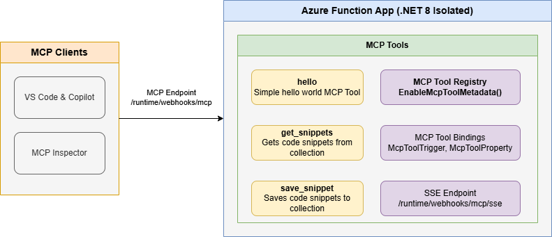

<!--
---
name: Remote MCP with Azure Functions (.NET/C#)
description: Run a remote MCP server on Azure functions.  
page_type: sample
languages:
- csharp
- bicep
- azdeveloper
products:
- azure-functions
- azure
urlFragment: remote-mcp-functions-dotnet
---
-->

# Getting Started with Remote MCP Servers using Azure Functions (.NET/C#)

This repo has a collection of samples to help you easily build and deploy a custom remote MCP server to the cloud using Azure functions. You can clone/restore/run on your local machine with debugging, and `azd up` to have a server in the cloud in a couple minutes.

All sample MCP servers are configured with [built-in authentication](https://learn.microsoft.com/en-us/azure/app-service/overview-authentication-authorization) using Microsoft Entra as the identity provider.

You can also use [API Management](https://learn.microsoft.com/azure/api-management/secure-mcp-servers) to secure the server, as well as network isolation using VNET.

If you're looking for samples in more languages check out the [Node.js/TypeScript](https://github.com/Azure-Samples/remote-mcp-functions-typescript) and [Python](https://github.com/Azure-Samples/remote-mcp-functions-python) samples.  

## Prerequisites

### Required for all development approaches

+ [.NET 10 SDK](https://dotnet.microsoft.com/download/dotnet/10.0)
+ [Azure Functions Core Tools](https://learn.microsoft.com/azure/azure-functions/functions-run-local?pivots=programming-language-csharp#install-the-azure-functions-core-tools) >= `4.0.7030`
+ [Azure Developer CLI](https://aka.ms/azd) **1.23.x or above** (for deployment)
+ [Docker](https://www.docker.com/) (for the Azurite storage emulator)

### For Visual Studio development

+ [Visual Studio 2022](https://visualstudio.microsoft.com/vs/)
+ Make sure to select the **Azure development** workload during installation

### For Visual Studio Code development

+ [Visual Studio Code](https://code.visualstudio.com/)
+ [Azure Functions extension](https://marketplace.visualstudio.com/items?itemName=ms-azuretools.vscode-azurefunctions)

> **Choose one**: You can use either Visual Studio OR Visual Studio Code. Both provide full debugging support, but the setup steps differ slightly.

Below is the architecture diagram for the Remote MCP Server using Azure Functions:

## Samples in this repo

Each project README has instructions for running locally, connecting to the MCP server, deploying to the cloud, and more.

| Project | Description | Getting Started |
|---------|-------------|-----------------|
| **FunctionsMcpTool** | MCP Tools — snippet CRUD, QR code generation, badges, website preview, auth (OBO) | [README](src/FunctionsMcpTool/README.md) |
| **FunctionsMcpApp** | MCP Apps — fluent API for tools that return interactive UI | [README](src/FunctionsMcpApp/README.md) |
| **FunctionsMcpResources** | MCP Resources — snippet resource template, server info resource | [README](src/FunctionsMcpResources/README.md) |
| **FunctionsMcpPrompts** | MCP Prompts — code review checklist, summarize content, generate docs | [README](src/FunctionsMcpPrompts/README.md) |
| **McpWeatherApp** | Weather App — MCP App demo with interactive UI | [README](src/McpWeatherApp/README.md) |

## Next Steps

+ Learn more about the [Azure Functions MCP extension](https://learn.microsoft.com/azure/azure-functions/functions-bindings-mcp?pivots=programming-language-typescript)
+ Follow our blog posts on [Azure SDK Blog](https://devblogs.microsoft.com/azure-sdk) and [Tech Community](https://techcommunity.microsoft.com/category/azure/blog/appsonazureblog) for updates. 

