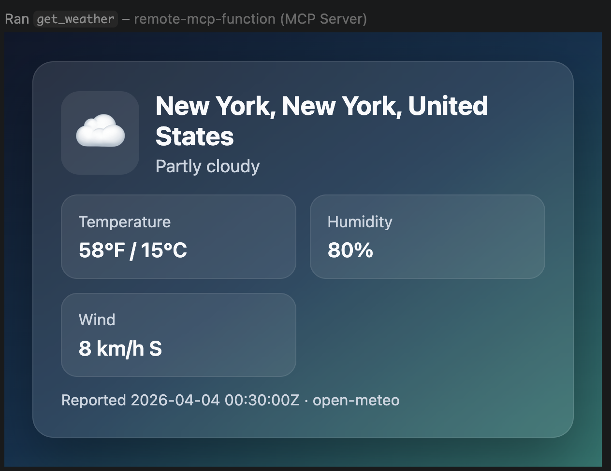

# Weather App Sample

A sample MCP App that displays weather information with an interactive UI.



## What Are MCP Apps?

[MCP Apps](https://modelcontextprotocol.io/extensions/apps/overview) let tools return interactive interfaces instead of plain text. When a tool declares a UI resource, the host renders it in a sandboxed iframe where users can interact directly.

### MCP Apps = Tool + UI Resource

The architecture relies on two MCP primitives:

1. **Tools** with UI metadata pointing to a resource URI
2. **Resources** containing bundled HTML/JavaScript served via the `ui://` scheme

Azure Functions makes it easy to build both.

## Prerequisites

- [.NET 10 SDK](https://dotnet.microsoft.com/download/dotnet/10.0)
- [Node.js](https://nodejs.org/) (for building the UI)
- [Azure Functions Core Tools v4](https://learn.microsoft.com/azure/azure-functions/functions-run-local)
- [Docker](https://www.docker.com/) (for the Azurite storage emulator)
- An MCP-compatible host (VS Code with GitHub Copilot, Claude Desktop, etc.)

## Getting Started

### 1. Build the UI

The UI must be bundled before running the function app:

```bash
cd app
npm install
npm run build
cd ..
```

This creates a bundled `app/dist/index.html` file that the function serves.

### 2. Run the Function App

```bash
func start
```

The MCP server will be available at `http://localhost:7071/runtime/webhooks/mcp`.

### 3. Connect from VS Code

Open **.vscode/mcp.json**. Find the server called _local-mcp-function_ and click **Start** above the name. The server is already set up with the running Function app's MCP endpoint:

```shell
http://localhost:7071/runtime/webhooks/mcp
```

### 4.Prompt the Agent

Ask Copilot: "What's the weather in Seattle?"

## Source Code

The source code is in [WeatherFunction.cs](WeatherFunction.cs). The key concept is how **tools connect to resources via metadata**.

### The Tool with UI Metadata

The `GetWeather` tool uses `[McpMetadata]` to declare it has an associated UI:

```csharp
// Required metadata
private const string ToolMetadata = """
    {
        "ui": {
            "resourceUri": "ui://weather/index.html"
        }
    }
    """;

[Function(nameof(GetWeather))]
public async Task<object> GetWeather(
    [McpToolTrigger(nameof(GetWeather), "Returns current weather for a location via Open-Meteo.")]
    [McpMetadata(ToolMetadata)]
    ToolInvocationContext context,
    [McpToolProperty("location", "City name to check weather for (e.g., Seattle, New York, Miami)")]
    string location)
{
    var result = await _weatherService.GetCurrentWeatherAsync(location);
    return result;
}
```

The `resourceUri` points to `ui://weather/index.html`— this tells the MCP host that when this tool is invoked, there's an interactive UI available at that resource URI.

### The Resource Serving the UI

The `GetWeatherWidget` function serves the bundled HTML at the matching URI:

```csharp
// Optional UI metadata
private const string ResourceMetadata = """
    {
        "ui": {
            "prefersBorder": true
        }
    }
    """;

[Function(nameof(GetWeatherWidget))]
public string GetWeatherWidget(
    [McpResourceTrigger(
        "ui://weather/index.html",
        "Weather Widget",
        MimeType = "text/html;profile=mcp-app",
        Description = "Interactive weather display for MCP Apps")]
    [McpMetadata(ResourceMetadata)]
    ResourceInvocationContext context)
{
    var file = Path.Combine(AppContext.BaseDirectory, "app", "dist", "index.html");
    return File.ReadAllText(file);
}
```

### How It Works Together

1. User asks: "What's the weather in Seattle?"
2. Agent calls the `GetWeather` tool
3. Tool returns weather data (JSON) **and** the host sees the `ui.resourceUri` metadata
4. Host fetches the UI resource from `ui://weather/index.html`
5. Host renders the HTML in a sandboxed iframe, passing the tool result as context
6. User sees an interactive weather widget instead of plain text

### The UI (TypeScript)

The frontend in `app/src/weather-app.ts` receives the tool result and renders the weather display. It's bundled with Vite into a single `index.html` that the resource serves.

### Deploy to Azure

#### Step 1: Sign in

```shell
az login
azd auth login
```

#### Step 2: Create an environment

```shell
azd env new <environment-name>
```

This also becomes the resource group name.

#### Step 3: Provision and deploy

By default, OAuth-based authentication is enabled using the [built-in MCP auth feature](https://learn.microsoft.com/azure/app-service/configure-authentication-mcp?toc=/azure/azure-functions/toc.json&bc=/azure/azure-functions/breadcrumb/toc.json) with Microsoft Entra as the identity provider.

Configure VS Code as an allowed client application for Microsoft Entra:

```shell
azd env set PRE_AUTHORIZED_CLIENT_IDS aebc6443-996d-45c2-90f0-388ff96faa56
```

Optionally enable VNet isolation:

```shell
azd env set VNET_ENABLED true
```

Deploy the project. When prompted, pick your subscription and an Azure region.

```shell
azd up
```

#### Connect to the remote MCP server

Open **`.vscode/mcp.json`** and click **Start** above the remote server entry for this project. You'll be prompted for `functionapp-name` — find it in your `azd` command output or the `.azure/<env>/.env` file. Since authentication is enabled, you'll also be prompted to sign in with Microsoft.

> **Tip:** A successful connection shows the number of tools the server exposes. Click **More... → Show Output** above the server name to see request/response details.

#### Redeploy and clean up

- **Redeploy:** `azd deploy`
- **Clean up all resources:** `azd down`

#### Other auth options

##### Key-based access

1. Set the auth level to `function` in `McpWeatherApp/host.json`:

    ```json
    "extensions": {
        "mcp": {
            "system": {
                "webhookAuthorizationLevel": "function"
            }
        }    
    },
    ```

2. Disable built-in MCP auth before deploying:

    ```shell
    azd env set ENABLE_AUTH false
    ```

3. Deploy with `azd up`.

4. Get the MCP extension system key from the Azure portal or CLI:

    ```shell
    az functionapp keys list --name <functionapp-name> --resource-group <resource-group> --query "systemKeys.mcp_extension" -o tsv
    ```

5. Add a key-based server entry to `.vscode/mcp.json` (VS Code will prompt you for both values on connect):

    ```jsonc
    {
        "servers": {
            "remote-functions-mcp-key": {
                "type": "http",
                "url": "https://${input:functionapp-name}.azurewebsites.net/runtime/webhooks/mcp",
                "headers": {
                    "x-functions-key": "${input:functions-mcp-extension-system-key}"
                }
            }
        },
        "inputs": [
            {
                "type": "promptString",
                "id": "functionapp-name",
                "description": "Azure Functions app name"
            },
            {
                "type": "promptString",
                "id": "functions-mcp-extension-system-key",
                "description": "Azure Functions MCP extension system key",
                "password": true
            }
        ]
    }
    ```

##### Anonymous access

To disable authentication entirely, set the following variable _before_ running `azd up`:

```shell
azd env set ENABLE_AUTH false
```

Then deploy with `azd up`. Anyone will be able to connect to the remote MCP server. This is **not** recommended unless the server is meant to be accessible by anyone (for example, serves publicly available info or data).

### Troubleshooting

| Problem | Solution |
|---------|----------|
| UI not loading | Make sure you ran `npm install && npm run build` in the `app/` directory before `func start` |
| `azd up` provision succeeded but deploy immediately failed: `unable to find a resource tagged with 'azd-service-name: mcp'` | The tag was provisioned but not propagated yet when `azd deploy` looked it up — run `azd deploy` again |
| `azd deploy` fails with Kudu restart error: `deployment was partially successful: [KuduSpecializer] Kudu has been restarted after package deployed` | Transient error — run `azd deploy` again |

## Next Steps

+ Learn more about the [Azure Functions MCP extension](https://learn.microsoft.com/azure/azure-functions/functions-bindings-mcp?pivots=programming-language-typescript)
+ Connect your MCP server to [Foundry agents](https://learn.microsoft.com/azure/azure-functions/functions-mcp-foundry-tools?tabs=oauth-id%2Cmcp-extension%2Cfoundry)
+ Add [API Management](https://github.com/Azure-Samples/remote-mcp-apim-functions-python) to your MCP server
